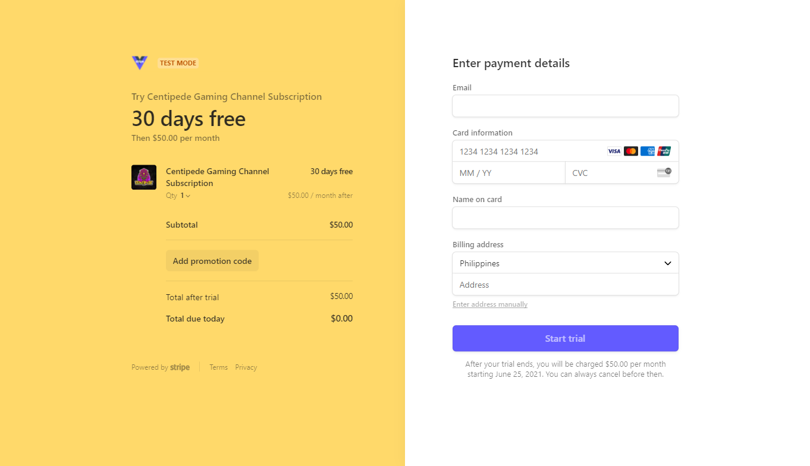

# 🎊 Welcome!

Vue Stripe is an official [Stripe partner](https://stripe.com/partners/vue-stripe).

## Stripe Checkout

Use Stripe's prebuilt Checkout to implement one-time payments or subscriptions with your Vue applications.


[stripe-checkout](stripe-checkout/)


## Stripe Elements

Integrate Stripe's collection of high-quality UI components to create payment forms in your Vue applications.


[stripe-elements](stripe-elements/)

